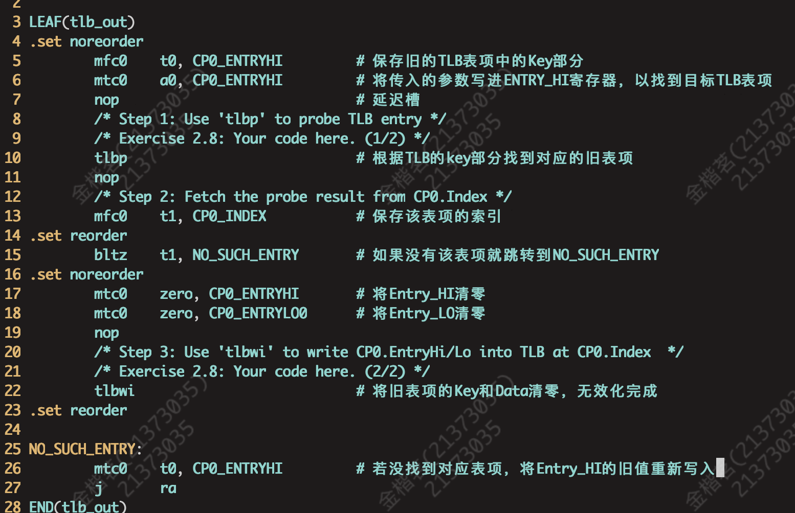
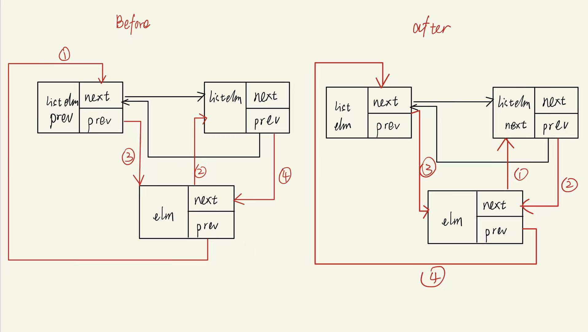

# Lab2实验报告
## 一、思考题
### **Thinking 2.1**  
**Q：请根据上述说明，回答问题:在编写的 C 程序中，指针变量中存储的地址 是虚拟地址，还是物理地址?MIPS 汇编程序中 lw 和 sw 使用的是虚拟地址，还是物理地址?**  
**A**：不论是编写的C程序还是汇编程序，使用的地址都是虚拟地址。所有程序使用的都是虚拟地址，只有CPU才使用物理地址。  
### **Thinking 2.2**  
**Q：从可重用性的角度，阐述用宏来实现链表的好处。**   
* 在多文件编程中，可以直接通过include操作引入宏，这一点函数就要比宏麻烦一些。
* 宏对代码块进行了封装，实现了代码的复用，高效简洁。

**Q：查看实验环境中的/usr/include/sys/queue.h，了解其中单向链表与循环链表的实 现，比较它们与本实验中使用的双向链表，分析三者在插入与删除操作上的性能差异。**
* 单向链表：删除元素时，若要删除第i个元素，则需遍历i-1个元素，时间复杂度为O（n）；若要给定删除元素地址，则时间复杂度为O（1）。插入元素时同理，若在某个元素前面插入、或是在第i个元素后插入，则时间复杂度为O（1）；若给定某个元素地址，在其后面插入，则时间复杂度为O（1）。
* 循环链表：由于存在一个指向尾元素的指针，若在链表尾部插入，则时间复杂度为O（1）。其余操作与单向链表时间复杂度相同。
* 双向链表：删除元素时，若要删除第i个元素，则需遍历i-1个元素，时间复杂度为O（n）；若要给定删除元素地址，则时间复杂度为  
O（1）。插入元素时，不论是在给定元素之前插入还是之后插入，时间复杂度都为O（1）；在第i个元素后插入则时间复杂度为  
O（n）。

### **Thinking 2.3**
**Q：请阅读 include/queue.h 以及 include/pmap.h, 将 Page_list 的结构梳 理清楚，选择正确的展开结构。**  
**A**：C

### **Thinking 2.4**
**Q1：请阅读上面有关 R3000-TLB 的描述，从虚拟内存的实现角度，阐述 ASID 的必要性。**  
**A1**：操作系统同时运行着多个进程，每个进程都有一个自己的地址空间，同一虚拟地址在不同的地址空间中通常映射到不同的物理地址，所以需要asid来记录当前是哪个地址空间，再映射到正确的物理地址。若无asid，仅根据虚地址则有可能映射到错误的物理地址。  
**Q2：请阅读《IDT R30xx Family Software Reference Manual》的 Chapter 6，结合 ASID 段的位数，说明 R3000 中可容纳不同的地址空间的最大数量。**  
**A2**：在R3000中，asid共占6位，所以一共可以容纳$2^{64}$个不同的地址空间。

### **Thinking 2.5**
**Q1：tlb_invalidate 和 tlb_out 的调用关系?**  
**A1**：tlb_invalidate调用了tlb_out函数。
**Q2：请用一句话概括tlb_invalidate的作用。**  
**A2**：在页表更新后将特定虚拟地址对应的TLB旧表项无效化。  
**Q3：逐行解释tlb_out中的汇编代码。**  
**A3**：如下图所示  

### **Thinking A.1**
**Q1：三级页表页目录的基地址**  
**A1**：页目录项个数 = 512 = $2^9$项，则二级页表项数 = $512^2$ = $2^{18}$项。依据理论课所讲公式，三级页目录基地址为
$PT_{base} = PT_{base} + PT_{base} >> 9 + PT_{base} >> 18$。  
**Q2：映射到页目录自身的页目录项(自映射)。**   
**A2**：三级页表项数 = $512^3$ = $2^{27}$项，自映射的页目录项为$PT_{base} = PT_{base} + PT_{base} >> 9 + PT_{base} >> 18 + PT_{base} >> 27$

### **Thinking 2.8**
**Q：简单了解并叙述 X86 体系结构中的内存管理机制，比较 X86 和 MIPS 在内存管理上
的区别。**  
**A：**
* 首先，二者内存管理机制不同，MIPS主要采用的是页式管理，X86采用的段页式管理。
* 其次，二者的TLB亦有差别。当TLB未命中时，MIPS 会触发TLB Refill 异常，内核的 tlb_refill_handler 会以 pgd_current 为当前进程的 PGD 基址，索引获得转换失败的虚址对应的PTE，并将其填入TLB；而 X86 在 TLB 不命中时，是由硬件 MMU 以 CR3 为当前进程的 PGD 基址，索引获得 PFN 后，直接输出 PA。同时 MMU 会填充 TLB 以加快下次转换的速度。
* 对于转换失败的地址，MIPS使用BadVAddr寄存器存放，X86使用CR2存放。

## 二、实验难点
* 首先我认为一大难点在于Exercise2.2中要用完成一个双向链表的插入，其实这部分内容在大一下的数据结构就有所涉及，但可惜当时对双项链表不作过高要求，我也就没有在意，~~果然欠的账迟早都是要还的~~。这部分我确实花了很久去理解，但其实只要把其中的逻辑理清楚，具体操作就非常简单了。我将步骤绘成示意图，如下图所示，其中黑色表示原有结构，红色表示新添的结构。  

* 其次我觉得lab2的一大难点是虚实地址的辨析，这一难点在Exercise2.6达到了顶峰，这一练习的目的是完成pgdir_walk函数，作用是根据页目录查找对应的页表项，由于要从内存中读出PTbase的物理地址，再转化为实地址，就非常复杂，需要在脑子里时刻提醒自己当前处理的地址是虚还是实，非常烧脑，不过课程组给的这张流程图倒是非常清晰的解释了这段流程。

* 最后其实我还觉得TLB的重填部分比较复杂，这一部分理论比较难，但实验非常简单，因为课程组给的提示非常友好，感谢课程组手下留情。

## 三、心得体会
&emsp;&emsp;lab2的代码量比lab1又显著的上了一个台阶，其中有很多函数和宏被引用时都需要去找寻源码来理解，而且lab2对于指针的运用更上一层楼，出现了很多指针的指针，理解起来就更加困难，不过做完lab2确实能够体会到指针的方便与强大。  
&emsp;&emsp;但要说lab2最困难的部分，还得是虚实地址的转化，切莫在这虚虚实实、实实虚虚中迷失了自我，要时刻紧绷着头脑。虽然过程很吃力，但是做完lab2以后还是明显能够感受到对理论作业的帮助的，感觉理论课的内容有一种融会贯通的感觉，依旧是收获满满的一个lab！