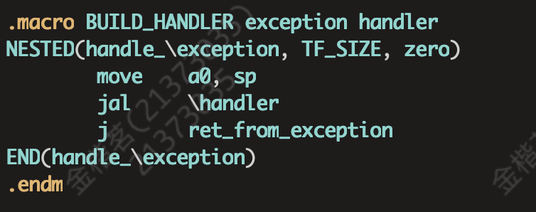
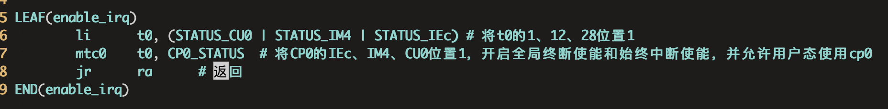
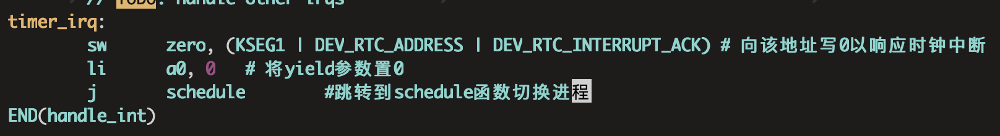
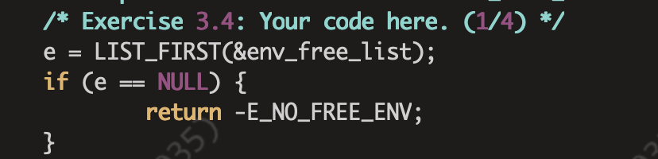
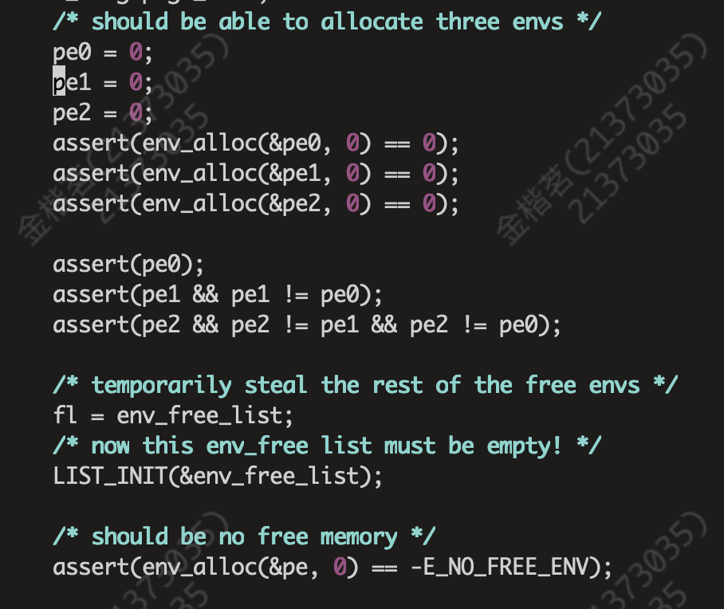
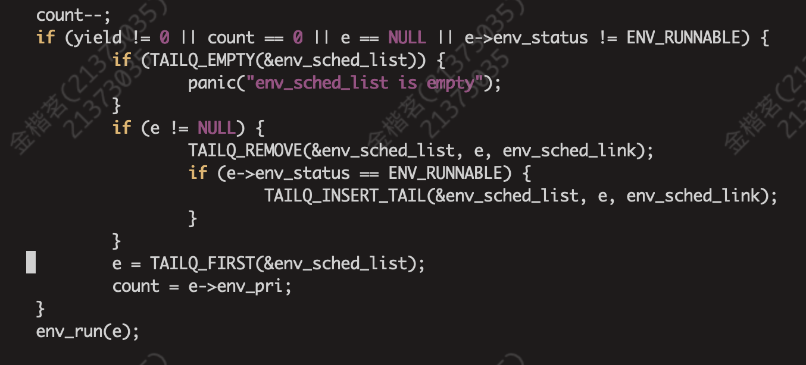

## Lab3实验报告
### 一、思考题
#### _Thinking 3.1_
**Q：请结合 MOS 中的页目录自映射应用解释代码中 e->env_pgdir[PDX(UVPT)] = PADDR(e->env_pgdir) | PTE_V 的含义。**
**A：** UVPT在整个内存空间的位置是进程自身页表开始的地址，UVPT相对于整个虚拟空间的偏移量为PDX（UVPT），在进程自身页目录中相同的偏移量的位置应该存放一个指向该页本身的页表项，里面存放的内容是该页目录的物理地址，故e->env_pgdir[PDX(UVPT)] = PADDR(e->env_pgdir)是在实现自映射机制，再和PTE_V进行或运算使得该页目录项有效。

#### *Thinking 3.2*
**Q：elf_load_seg 以函数指针的形式，接受外部自定义的回调函数 map_page。 请你找到与之相关的 data 这一参数在此处的来源，并思考它的作用。没有这个参数可不可 以?为什么?**
**A：** 寻找elf_load_seg的调用关系，发现其是在env.c中的load_icode函数中实现的，具体实现代码为：
`panic_on(elf_load_seg(ph, binary + ph->p_offset, load_icode_mapper, e));`
发现data这个参数传递的是进程e，在elf_load_seg中的作用是传递给回调函数，在load_icode_mapper中的作用是用这个进程的信息如页目录、asid等创建一个新的页，并插入到页表中，以实现加载elf文件至进程e中。显然不可以没有这个参数。

#### *Thinking 3.3*
**Q：结合 elf_load_seg 的参数和实现，考虑该函数需要处理哪些页面加载的情况。**
**A：** elf_load_seg的参数为`elf_load_seg(Elf32_Phdr *ph, const void *bin, elf_mapper_t map_page, void *data)`， 在参考实现代码后，我认为对于如下参数的不同情况如下：
* va：
     * 与页面大小对齐
     * 与页面大小不对齐
 * bin_size：
    * 小于一页大小
    * 大于一页大小
* sg_size：
    * sgsize = bin_size：不需要填充
    * sgsize > bin_size：需要填充
* va + bin_size：
    * 未超出va所在页内
    * 超出va所在页内
    * 按页面大小对齐
    * 未按页面大小对齐
  
#### *Thinking 3.4*
**Q：你认为这里的 env_tf.cp0_epc 存储的是物理地址还是虚拟地址?**
**A：** 虚拟地址，根据计算机组成原理课设中P7的内容，EPC存的是异常结束后程序恢复运行的地址，既然是程序执行的地址，那自然就是虚拟地址了。

#### *Thinking 3.5*
**Q：试找出上述 5 个异常处理函数的具体实现位置。**
**A：**
* handle_int：kern/genex.S
* handle_mod，handle_tlb，handle_sys都是通过宏函数`BUILD_HANDLER`所完成的。如下图所示：
* 

#### *Thinking 3.6*
**Q：阅读 init.c、kclock.S、env_asm.S 和 genex.S 这几个文件，并尝试说出 enable_irq 和 timer_irq 中每行汇编代码的作用。**
**A：** 

#### *Thinking 3.7*
**Q：阅读相关代码，思考操作系统是怎么根据时钟中断切换进程的。**
**A：** 操作系统中设置一就绪队列env_sched_list，每次响应到时钟中断时就有异常处理程序handle_int跳转到进程切换函数schedule。schedule函数中依据时间片轮转的算法进行调度，当检测到需要切换进程时，就将就绪队列中第一个元素取出，若该进程正在运行，则将其插入到队尾，直到找到符合要求的进程为止，如此完成了进程间的切换。

### 二、实验难点
本次Lab3个人认为难度尚可，以下将从实验和理论两个角度分别阐述我认为的难点。
* 实验部分
  * 首先是exercise3.4，下图所示这处代码卡了我非常久。
    
我被卡住是因为忘记添加当进程块分配不成功时返回异常，这本应是顺理成章的事情，但是我在编写代码时过于依赖提示，而提示有没有写这段，于是我便忘记了这一点，在de了很久之后去研究了检测代码，如下图所示，才发现有对于异常返回值的检测。
    
  * 其次是exercise3.12的schedule函数，这个函数很重视理顺代码逻辑。其中我认为有两个坑点，一个是要考虑到当curenv为NULL时的情况，也就是还没开始运行任何一个进程时，如果不加判断可能会导致程序卡死。其次是要注意在此时就把时间片count减1。
    
* 理论部分
    这部分理解的难点是在于理解进程创建时的函数调用关系，较为复杂，需要花一点耐心去理清顺序。

### 三、心得体会
Lab3的主要任务是实现进程的创建、调度、切换，需要同时使用c语言与汇编语言来完成，同时也需要运用Lab2的页式存储的知识，可以说有一定的难度。但个人认为难度又不算很大，主要归功于课程组的提示给的较为清晰，只要耐心的读完提示，那么实现功能应该不是很困难的事情。
虽说Lab3的难度不是很大，但也给了我非常惨痛的教训，就是不能过于依赖课程组的提示。就如同在前文难点分析一节中所说的，在依靠课程组提示的同时也要自己独立的思考这个函数有什么功能、应该怎么实现、有什么坑点，不能过于依赖提示，否则就会导致我在完成时被卡一个多小时的情况。还有一点就是不能只满足于通过评测，Lab3的函数调用关系非常复杂，要在实现之后即使复盘。
