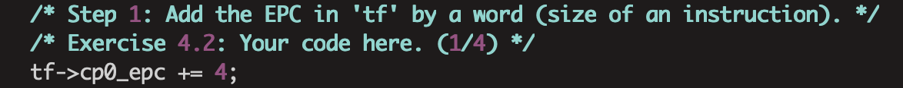
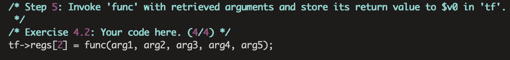
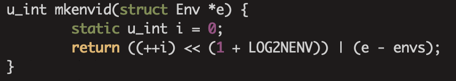
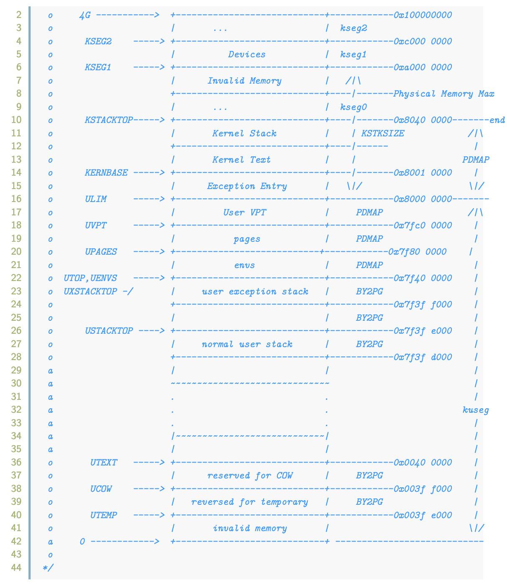
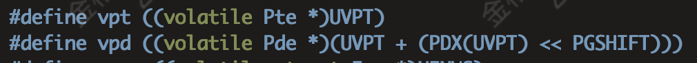
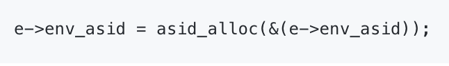
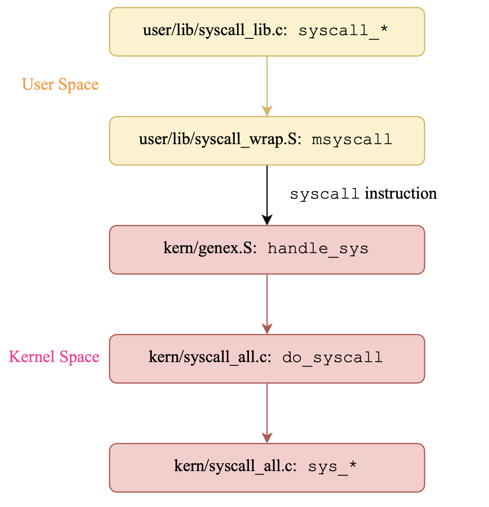
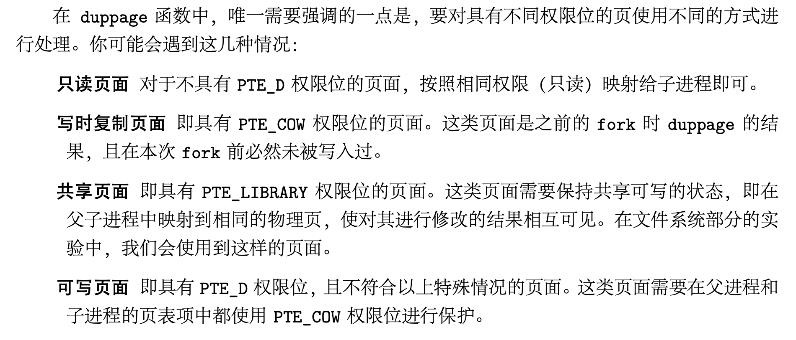
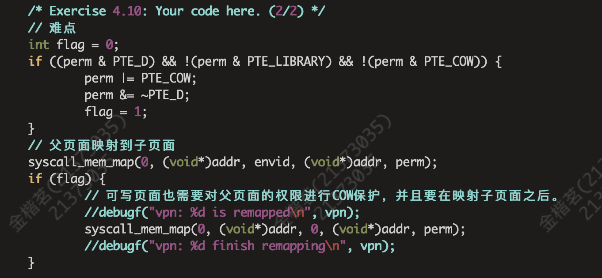
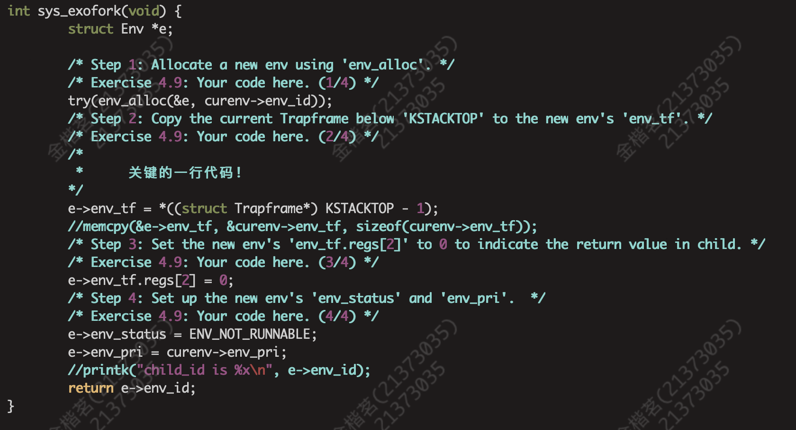

## Lab4实验报告
### 一、思考题
#### Thinking 4.1
* **Q：内核在保存现场的时候是如何避免破坏通用寄存器的?**
  **A：** 用户态下执行 syscall 指令会触发异常，CPU 陷入内核态，内核使用 SAVE_ALL 宏将用户进程的上下文运行环境保存在内核栈中。
* **Q：系统陷入内核调用后可以直接从当时的\$a0-\$a3参数寄存器中得到用户调用msyscall 留下的信息吗?**
  **A：** 不可以，系统在异常发生时会将系统调用号存入\$a0，所以此时\$a0的值是被改变过的。而\$a1-\$a3寄存器的值虽然在系统调用的过程中没被使用，但或许会有其他操作用到这些寄存器。故还是应该从内核栈中取出这几个寄存器的值，内核栈里的通用寄存器可以保证是初始的值。
* **Q：我们是怎么做到让sys开头的函数“认为”我们提供了和用户调用msyscall时同样 的参数的?**
  **A：** 用户调用msyscall时，将前三个参数保存在\$a1-\$a3中，后两个参数保存在用户栈中，陷入内核时，用户栈会被完整地拷贝在内核栈中，所以sys_*函数可以通过\$a1-\$a3与栈来获取参数。
* **Q：内核处理系统调用的过程对Trapframe做了哪些更改?这种修改对应的用户态的变 化是什么?**
  **A：**主要在do_syscall这个函数中对Trapframe进行了修改，首先让tf的epc值+4，对应用户态的变化是让程序从系统调用指令的后一条开始执行；其次让\$v0寄存器的值存放所调用的sys_*函数的返回值，让用户态可以获取到系统调用函数的返回值。
  
  

#### Thinking 4.2
**Q：为什么 envid2env 中需要判断 e->env_id != envid 的情况?如果没有这步判断会发生什么情况?**
**A:** 可以看到这步的判断是发生在envid不等于0的情况下，也就是要查找的env不为当前正在运行的curenv。那么就需要在envs这个数组里根据envid，使用ENVX这个宏去索引到目标env，判断e->env_id != envid是为了确保这个索引的过程正确。

#### Thinking 4.3
**Q：思考下面的问题，并对这个问题谈谈你的理解:请回顾 kern/env.c 文件 中 mkenvid() 函数的实现，该函数不会返回 0，请结合系统调用和 IPC 部分的实现与 envid2env() 函数的行为进行解释。**
**A：** mkenvid的实现过程如下图所示：

LOG2NENV是一个定值10，++i永远不会是0，所以$++i << (1 + LOG2NENV)$永远不会是0。再加上进程e的偏移量就更不会是0。
至于该函数不返回0的原因是envid2env这个函数中需要将envid == 0这种情况作为查找curenv的标识，方便了程序直接通过0来访问当前正在运行的进程控制块。

#### Thinking 4.4
**Q：关于 fork 函数的两个返回值，下面说法正确的是:
A、fork 在父进程中被调用两次，产生两个返回值
B、fork 在两个进程中分别被调用一次，产生两个不同的返回值
C、fork 只在父进程中被调用了一次，在两个进程中各产生一个返回值
D、fork 只在子进程中被调用了一次，在两个进程中各产生一个返回值**
**A：** C，fork函数在子进程中返回值为0，在父进程中返回值不为0， 而为子进程的 pid。

#### Thinking 4.5 
**Q：我们并不应该对所有的用户空间页都使用 duppage进行映射。那么究竟哪 些用户空间页应该映射，哪些不应该呢?请结合 kern/env.c 中 env_init 函数进行的页 面映射、include/mmu.h 里的内存布局图以及本章的后续描述进行思考。**
**A：** 内存布局图如下图所示：

kern/env.c的env_init（）里的最后两行将内核中的Page和Env数据结构映射到用户地址，以供用户程序读取。由上面的内存布局图可知，UTOP和ULIM之间储存的是和内核相关的页表信息，这部分在env_init( )函数里已经映射过了，不需要再次映射。UTOP和USTACKTOP之间是异常处理栈和无效内存，前者是进行异常处理的地方， 后者一般也不会用到，所以父子进程不需要共享这部分的内存，不需要映射。故只有USTACKTOP之下的部分需要被映射，映射时需注意检测页表项有没有效。

#### Thinking 4.6
* **Q：vpt 和 vpd 的作用是什么?怎样使用它们?**

  **A：** vpt是指向用户页表的基地址的指针，vpd是指向页目录的基地址的指针，使用时先用*解引用再加上偏移量即可得到页表项地址。
* **Q：从实现的角度谈一下为什么进程能够通过这种方式来存取自身的页表?**
  **A：** 进程在创建时已经将内核里的页表映射到用户的地址空间里了，UVPT是用户的页表基地址，根据自映射原理以及理论课所讲的由页表基地址求页目录基地址的公式：$PD_{base} = PT_{base} + PT_{base} >> 10$，可知vpd是页目录的基地址。
* **Q：它们是如何体现自映射设计的?**
  **A：** 页目录基地址vpd位于[UVPT， UVPT+4KB]之间的某一地址，所以页目录就在页表的内部，而每一个页表都被页目录映射，所以页目录里有一项映射它自己，即自映射。
* **Q：进程能够通过这种方式来修改自己的页表项吗?**
  **A：** 不能，用户对于页表没有修改权限，只能访问。

#### Thinking 4.7
**在 do_tlb_mod 函数中，你可能注意到了一个向异常处理栈复制 Trapframe 运行现场的过程，请思考并回答这几个问题:**
* **Q：这里实现了一个支持类似于“异常重入”的机制，而在什么时候会出现这种“异常重入”?**
  **A：** mos的写时复制（COW）特性是依靠“页写入异常”机制实现的，当需要COW时就取消该页的PTE_D标记，进入do_tlb_mod函数，但是当这个函数的处理过程又写了一个COW页时就需要异常重入。
* **Q：内核为什么需要将异常的现场 Trapframe 复制到用户空间?**
  **A：** MOS采用微内核的设计理念，尽可能地将功能实现在用户空间中，其中也包括 了页写入异常的处理，因此主要的处理过程是在用户态下完成的，所以需要将异常的现场复制到用户空间中。

#### Thinking 4.8
**Q：在用户态处理页写入异常，相比于在内核态处理有什么优势?**
**A：**（1）符合微内核的设计理念，减轻了内核的工作负担；（2）提高了安全性，减少了内核崩溃的可能性，即使用户程序出错也不会影响整个操作系统，减小了犯错的代价；（3）灵活性高，用户态进行新页面的分配映射更方便。

#### Thinking 4.9
* **Q：为什么需要将 syscall_set_tlb_mod_entry的调用放置在 syscall_exofork之前?**
  **A：** syscall_set_tlb_mod_entry的作用是为进程设置页写入异常的处理函数，这一部分在父子进程应当是相同的。父进程调用syscall_exofork创建子进程，此时父进程之后的代码也要在子进程中运行，若将syscall_set_tlb_mod_entry放在syscall_exofork之后会造成不必要的开销。
* **Q：如果放置在写时复制保护机制完成之后会有怎样的效果?**
  **A：** 肯定是不能放在写时复制保护机制之后的，该函数的作用就是为程设置页写入异常的处理函数，而COW机制就要依靠页写入异常机制。若放在写时复制保护机制之后，则子进程就没有被指定页写入异常的处理函数，没有建立起页写入异常机制，无法实现COW机制。

### 二、难点分析
* **Lab3遗留问题**
  在写Lab4的时候，有一个bug花费了我前后共两天的时间，死活也找不出来，后来发现竟是Lab3的遗留问题，为此我还挂了Lab3的课上，可以说是教训相当惨痛。
  
  如上图所示，我在创建进程时错误的设置了env_asid，原因在于对二重指针理解不到位。
* **系统调用的处理流程**
  Lab4应该是我们第一次接触内核态与用户态的交互问题，这一部分也是个难点。用户使用系统调用，陷入到内核态处理系统调用，用户态调用的是syscall_\*函数，要经过一系列过程到内核态的sys_\*函数。这一部分刚看指导书可能还会有点晕，但完全不用担心自己掌握不了，因为在后续debug的过程中会无数次的在脑子里重复这个过程，因为涉及到用户态与内核态的切换，所以也很难确定自己的bug是出在内核态里的代码还是用户态里的代码，经过Lab4的debug过程后我甚至都快要达到能默写下图的程度，可见debug之艰辛。
  
* **duppage函数的实现**
  duppage函数是被调用在fork函数里的一个函数，用于向子进程复制父进程的页面。难点在于不是所有父进程的页面都要被复制，只需复制符合条件的页面。指导书对于这部分列出了四种情况，但并未详细告诉读者该如何处理，如下图所示：
  
  我自己总结了对于这部分该如何处理：只需要对最后一种情况特殊考虑即可，其他页面父进程与子进程的权限相同，而只具有PTE_D的页面需要对父页面和子页面标记上PTE_COW，同时取消PTE_D，这样才会触发页写入异常机制。而在实现时要特别注意修改父进程的权限位要在子进程之后，具体实现如下图所示：
  
* **将父进程的trapframe复制到子进程**
  在sys_exofork函数中，需要将当前的Trapframe复制给子进程，起初我一直不明白如何复制，还用了memcpy等方法，后来才发现直接将[sp - sizeof(tf), sp]这段内存复制过去就可以了，代码如下。

### 三、心得体会
Lab4是我做到现在最费力，也是耗时最久的一个Lab，主要是因为这次涉及到了用户态与内核态的切换，需要把那一系列流程搞清楚，还有一个原因是fork过程本身原理也较为复杂，实现过程又比较困难，最困难的是关于创建子进程的代码不管是哪里出错，报错信息都是只有父进程（i am father），这也导致了debug的过程非常艰辛。但艰辛的debug过程也让我重读了很多遍代码，理清了函数之间的调用关系，让我收获很大，创建子进程是操作系统里很重要的概念，经过Lab4我对这一理念理解的更为深刻，令我收获十足
