# Lab5实验报告
## 一、思考题
### Thinking 5.1
**Q：如果通过 kseg0 读写设备，那么对于设备的写入会缓存到 Cache 中。这是 一种错误的行为，在实际编写代码的时候这么做会引发不可预知的问题。请思考:这么做 这会引发什么问题?对于不同种类的设备(如我们提到的串口设备和 IDE 磁盘)的操作会 有差异吗?可以从缓存的性质和缓存更新的策略来考虑。** 
**A：** 对于其他地址空间，都是通过CPU来访问并且修改数据的，而Cache也是经过CPU访问；但对于映射外部设备的地址空间，外部设备也可以访问并且修改数据，这可能就会导致内存与Cache数据不一致，Cache的数据要滞后于内存的数据，在访问时很有可能访问到错误的数据。  
有差异，串口设备是字符设备，无需经过缓存，直接以字符为单位进行读写，并且读写频繁；IDE磁盘属于块设备，需通过缓存访问外设，读写频率较小。IDE磁盘访问错误的概率远小于串口设备。
### Thinking 5.2
**Q：查找代码中的相关定义，试回答一个磁盘块中最多能存储多少个文件控制 块?一个目录下最多能有多少个文件?我们的文件系统支持的单个文件最大为多大？**
**A：** 文件控制块结构体的定义如下图所示：
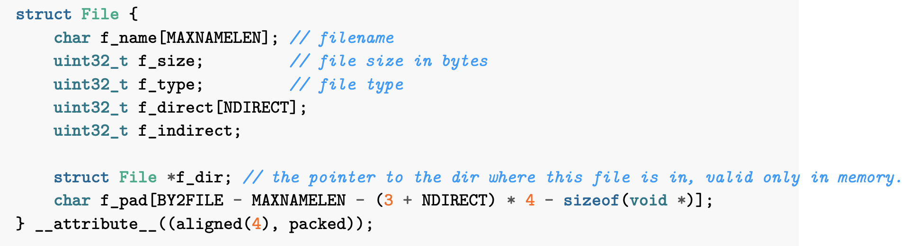
可以看到最后一个属性f_pad，它的作用就是为了让整数个文件结构体占用一个磁盘块，填充结构体中剩下的字节，所以一个文件控制块的大小为BY2FILE，即256B。每个磁盘块的大小为4KB，所以一共能容纳$4KB/256B = 16$个文件控制块。一个文件控制块最多可以使用$4KB / 4 = 1024$个指针，也就是说一个目录里最多有$16 * 1024 = 16384$个文件。一个文件有1024个指针，也就是说最多可以用1024个磁盘块，每个磁盘块4KB，一共有$1024 * 4KB = 4MB$的大小。
### Thinking 5.3
**Q：请思考，在满足磁盘块缓存的设计的前提下，我们实验使用的内核支持的最 大磁盘大小是多少?**
**A：** 磁盘的最大容量已经在DISKMAX中有所定义，为0x40000000，即1GB的空间。
### Thinking 5.4
**Q：在本实验中，fs/serv.h、user/include/fs.h 等文件中出现了许多宏定义， 试列举你认为较为重要的宏定义，同时进行解释，并描述其主要应用之处。**
**A：** 以下是两个文件的宏定义，用途见注释
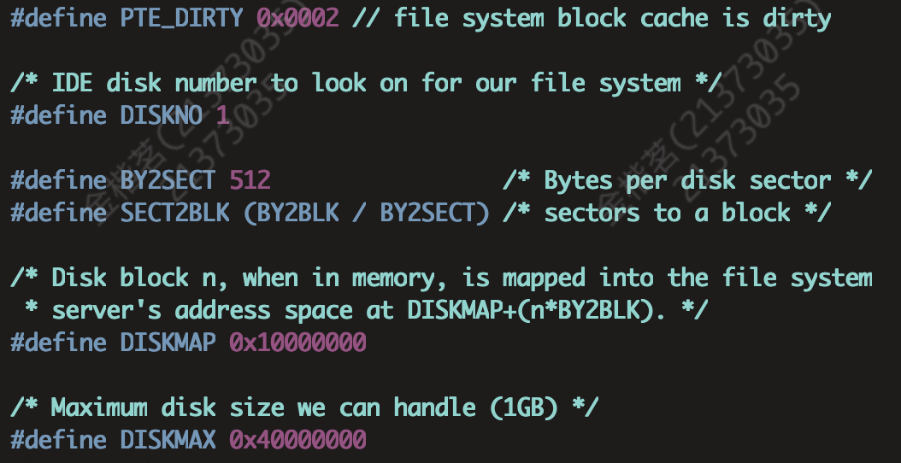
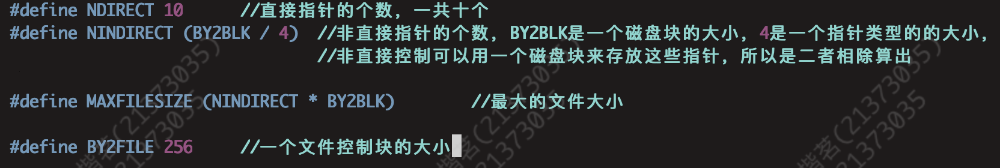
### Thinking 5.5
**Q：在 Lab4“系统调用与 fork”的实验中我们实现了极为重要的 fork 函数。那 么 fork 前后的父子进程是否会共享文件描述符和定位指针呢?请在完成上述练习的基础上 编写一个程序进行验证。**
**A：** 会，因为文件描述符和定位指针都位于用户空间中，父子进程会共享这一部分。
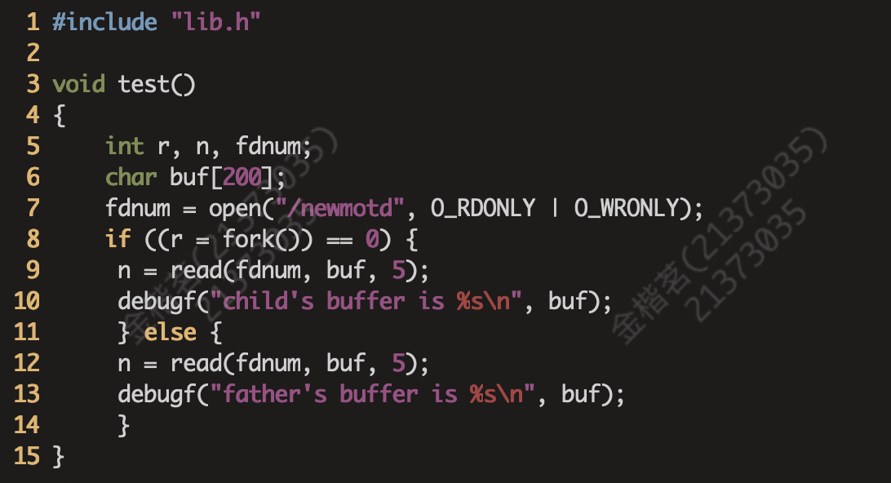
### Thinking 5.6
**Q：请解释 File, Fd, Filefd 结构体及其各个域的作用。比如各个结构体会在哪些过程中被使用，是否对应磁盘上的物理实体还是单纯的内存数据等。说明形式自定，要求简洁明了，可大致勾勒出文件系统数据结构与物理实体的对应关系与设计框架。**
**A：**
* File：
  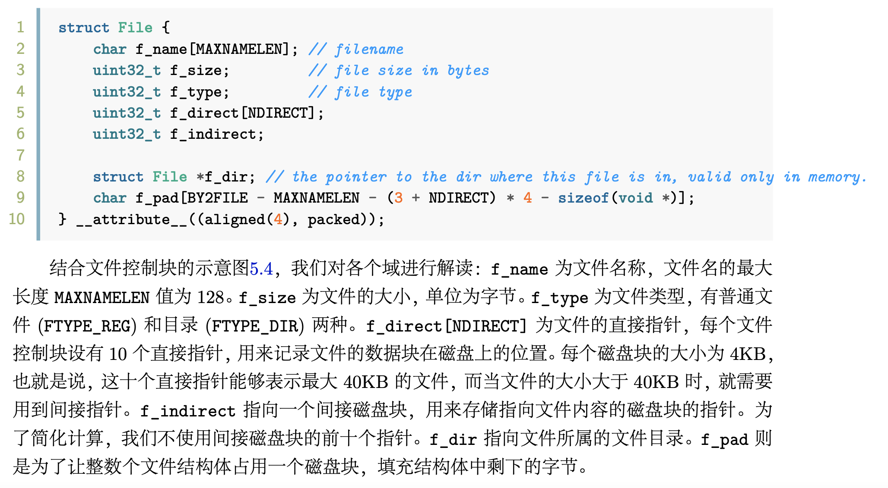
  File结构体及其各个域的作用指导书已经解释的很清楚了，该结构体主要是操作系统在访问和管理文件时使用，此处不多赘述。
* Fd：
  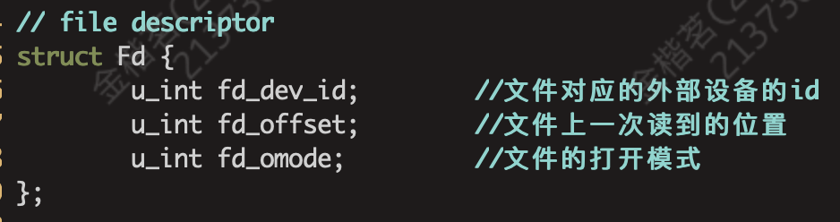
  Fd是文件描述符，用于给用户提供文件上次读的位置以及打开状态，方便用户访问、修改文件。应该是不对应物理实体的。
* Filefd：
  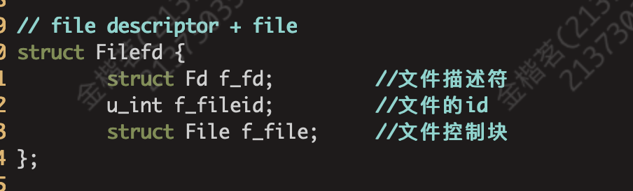
  仅使用文件描述符在一些情况下是不够用的，可以通过类型强制转换将fd转为Filefd，这样就可以获取到文件控制块，获取更多关于文件的信息。
### Thinking 5.7
**Q：图5.7中有多种不同形式的箭头，请解释这些不同箭头的差别，并思考我们的操作系统是如何实现对应类型的进程间通信的。**
**A：** 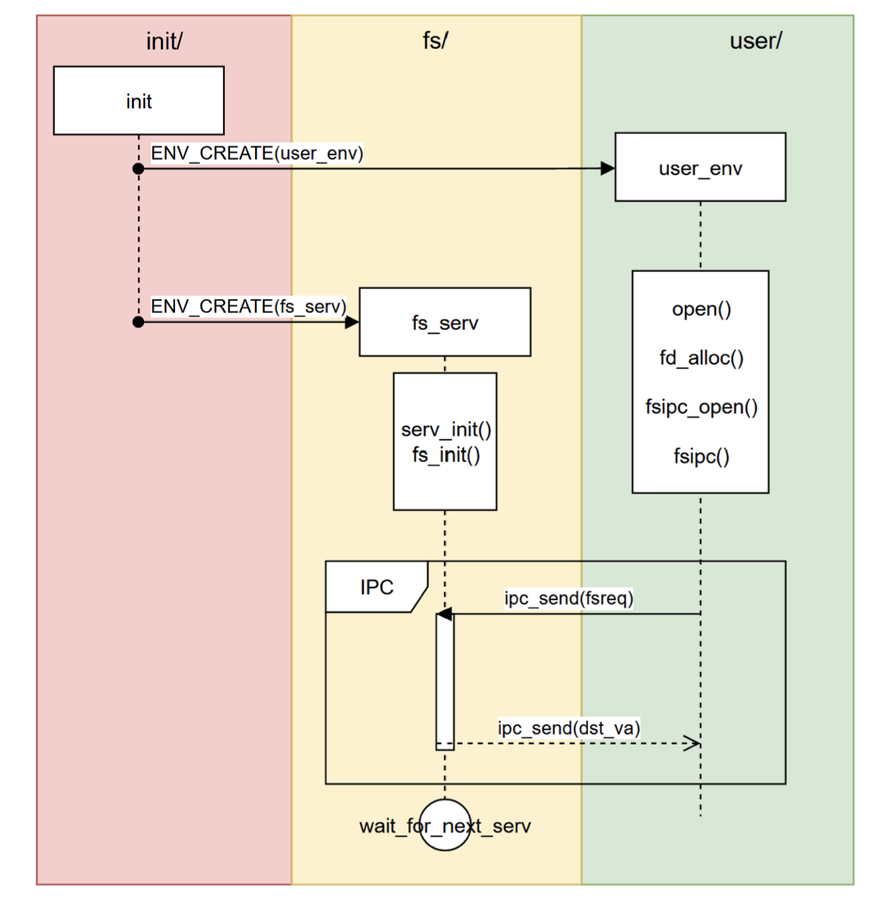
可以看到时序图中有两种箭头：
* 其中一个是黑色实三角+黑色实线，表示主动类型的同步调用或者请求；
* 另一种是黑色开三角+黑色虚线，表示收到请求后异步的返回过程。
同步请求发出以后，消息的发出者进入轮询状态等待接收者接受，当接收者收到消息以后就暂停，等待接收者返回。
我们的操作系统通过fsipc这个函数完成进程间通信。

## 二、实验难点
### 1、理解驱动程序并编写
这一部分指导书要求我们仿照给出的一个汇编程序完成代码填空。这一部分大体流程不难，但其中有一个难点在于理解填入的偏移量是什么相对于哪个地址的。
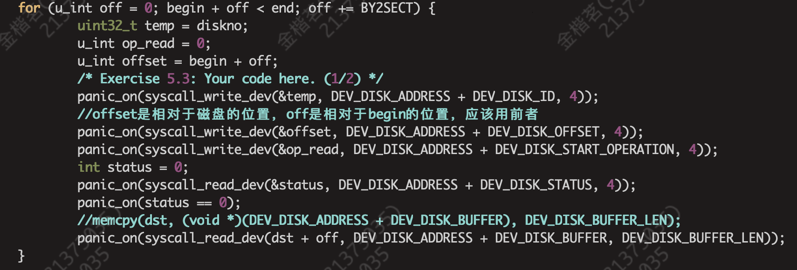
如上图所示，ide_read的函数中有一个容易误导我们的变量off，如注释所写，off是相对于begin的偏移量，begin + off才是相对于磁盘起始位置的偏移量，应该存入begin + off，这一部分off由于命名起到了一定的误导作用。
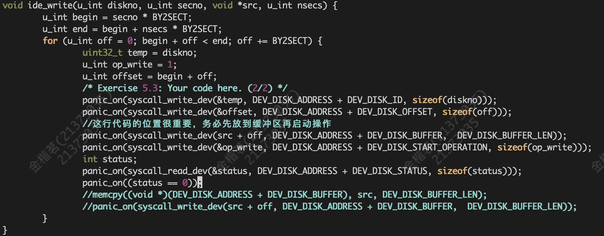
在ide_write这个函数中，要特别注意这几步操作的顺序，这部分与读操作有一定的区别，在于写磁盘需要先将要写入对应扇区的 512 bytes 的数据放入设备缓冲区中，然后向地址 0xB3000020 处写入 1 来启动操作，不可以完全按照读操作去写，否则此时缓冲区还没有东西，不能写到外设中。
这里体现出缓冲区的作用，不论是读还是写操作都不能直接跟内存打交道，要通过缓冲区。读操作中要从缓冲区读取东西，要先启动才能读取缓冲区；而写操作中是将缓冲区里的东西写入内存，要先向缓冲区填写数据，再启动写操作，否则缓冲区里的数据不能及时更新。
### 2、理解文件控制块的文件查找方式
上文中已经解释过文件控制块结构体的各个域的作用，这里不再赘述。当文件控制块要查找文件时，先检索直接指针指向的磁盘块符不符合，再检索间接指针，然后遍历找到的磁盘块里的文件，体现在实验中如下图所示：
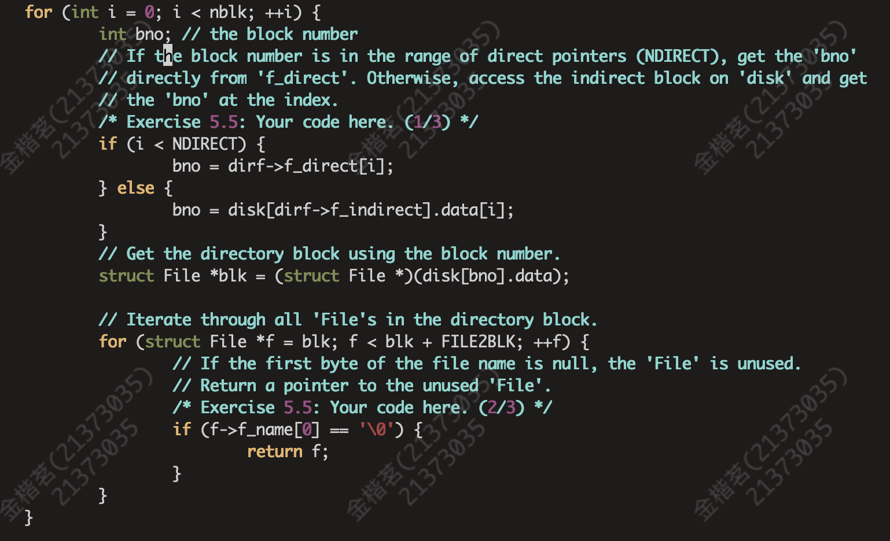
### 3、理解Fd和FileFd的联系与区别
* 联系：Fd与Filefd可以强制转换，是因为Filefd 结构体的第一个成员就是 Fd，因此指向 Filefd 的指针同样指向这个 Fd 的起始位置，并且C语言中类型强制转换是不改变指针的值，只是改变系统对于一个内存地址的解读方式；通俗的来讲就是Filefd是文件+文件标识符，而fd是标识符而已。
* 区别：文件标识符带给用户的信息较为有限，而Filefd还允许用户解读文件本身，当我们需要更多信息的时候就需要转换为Filefd。
### 4、整体理解文件系统         
在做操作系统的实验时，很容易陷入每个函数都理解但是建立不起来整体的概念，到了Lab5，随着代码量、函数量的增多，这个问题就更为显著，所以要将下图完全理解着实是一个难点：
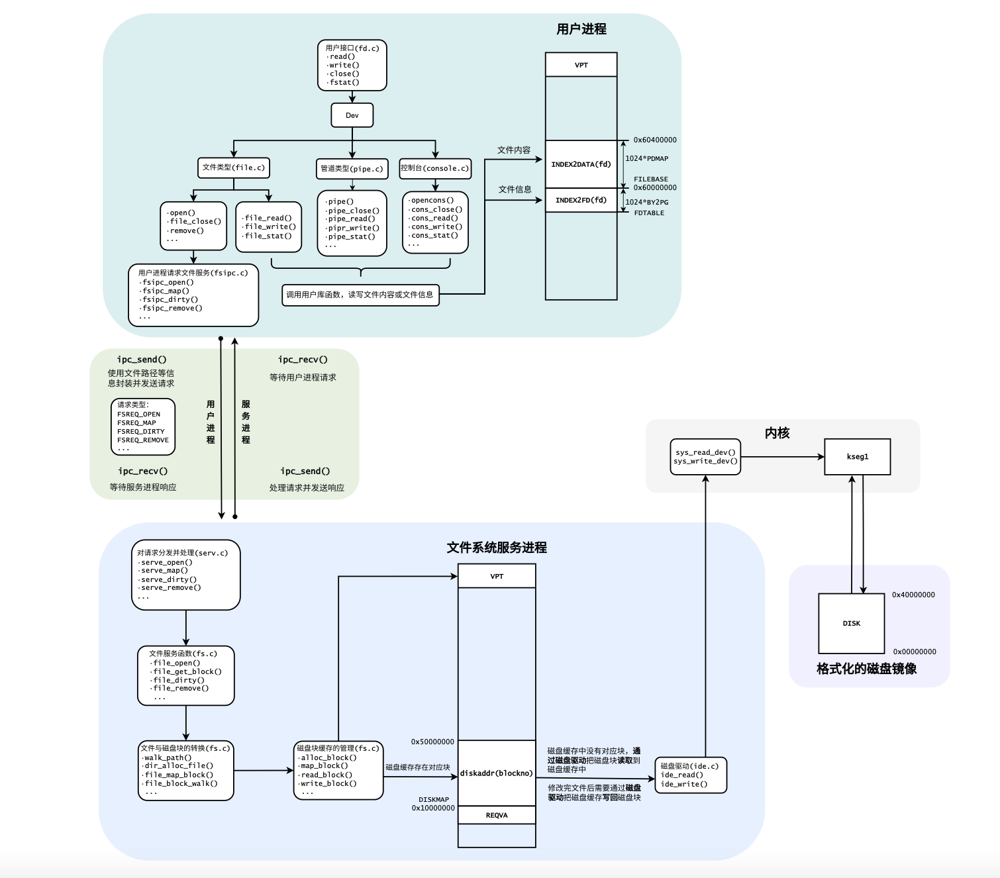
## 三、心得体会
Lab5的实验部分难度较Lab4有所降低，基本上仔细阅读指导书及代码注释即可。但是Lab5涉及的代码量显著增加，要想理解每个函数的作用以及建立整体的对文件系统的认知仍然需要花很多时间钻研，不能只满足于通过评测，要深入的理解那些填空用不到的函数也是很关键的一步。