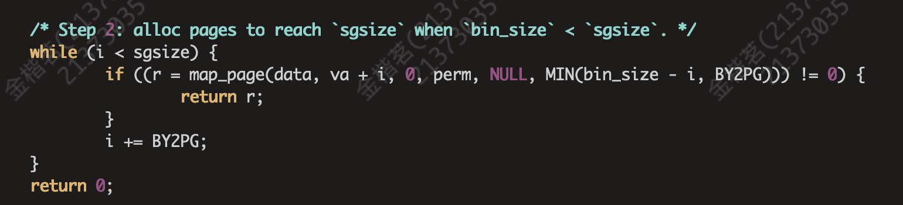
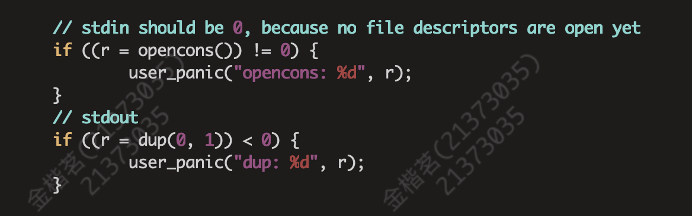
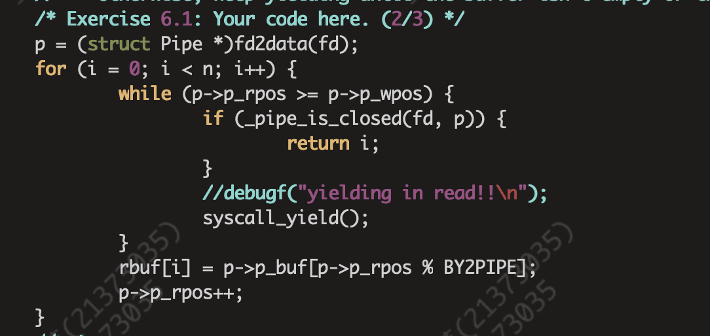
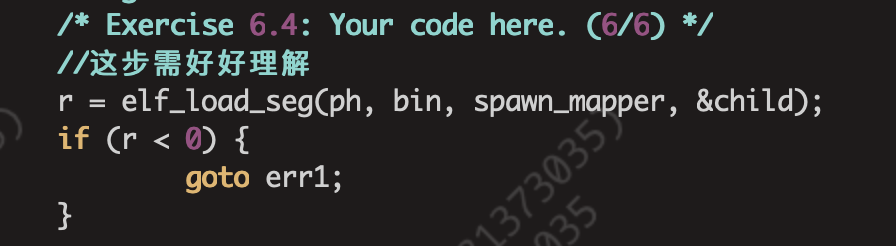

# Lab6实验报告
## 一、思考题
### Thinking6.1
**Q：示例代码中，父进程操作管道的写端，子进程操作管道的读端。如果现在想 让父进程作为“读者”，代码应当如何修改？**
```c
#include <stdlib.h>
#include <unistd.h>
int fildes[2];
char buf[100]; int status;
int main(){
    status = pipe(fildes);
if (status == -1 ) { printf("error\n");
}
switch (fork()) { 
    case -1:
        break;
    case 0: /* 子进程 - 作为管道的写者 */ 
        close(fildes[0]);
        write(fildes[1], "Hello world\n", 12); 
        close(fildes[1]);
        exit(EXIT_SUCCESS);
    default: /* 父进程 - 作为管道的读者 */ 
        close(fildes[1]);
        read(fildes[0], buf, 100); 
        printf("father-process read:%s",buf); 
        close(fildes[0]); 
        exit(EXIT_SUCCESS);
    }
}
```
修改后的代码如上图所示

### Thinking6.2
**Q：上面这种不同步修改 pp_ref 而导致的进程竞争问题在 user/lib/fd.c 中 的 dup 函数中也存在。请结合代码模仿上述情景，分析一下我们的 dup 函数中为什么会出 现预想之外的情况?**
**A：** dup函数的作用是将一个文件描述符复制给另一个，以此实现文件的复制。dup函数的实现步骤是先将newfd所在的虚拟页映射到oldfd所在的物理页，再将newfd的数据所在的虚拟页映射到oldfd的数据所在的物理页。
```c
// 子进程
    read(p[0], buf, sizeof(buf));
// 父进程    
    dup(p[0], newfd);
    write(p[1], "Hello", 5);
```
在以上示例中，子进程先进行，若read之前发生中断，切换到父进程，若此时dup和write之间发生中断，父进程执行完dup以后没来得及往管道里写东西。切换回子进程，执行read函数，发现pageref(p[0]) == pageref(pipe) == 2，误认为通道关闭，发生了错误。

### Thinking6.3
**Q：阅读上述材料并思考:为什么系统调用一定是原子操作呢?如果你觉得不是 所有的系统调用都是原子操作，请给出反例。希望能结合相关代码进行分析说明。**
**A：** 在mos的实现中，我没有找到关闭中断的代码，但是进入内核态确实是需要关闭中断的，想必应该是交给硬件实现了，既然关闭了中断那么就必然是原子操作。但是沃天宇老师也说过，系统调用未必都是原子操作。在mos以外的操作系统中应该还有别的方式打断系统调用。


### Thinking6.4
**Q：仔细阅读上面这段话，并思考下列问题
• 按照上述说法控制pipe_close中fd和pipeunmap的顺序，是否可以解决上述场
    景的进程竞争问题?给出你的分析过程。
• 我们只分析了close时的情形，在fd.c中有一个dup函数，用于复制文件描述符。 试想，如果要复制的文件描述符指向一个管道，那么是否会出现与 close 类似的问 题?请模仿上述材料写写你的理解。**
**A：**
* 可以解决。因为本来pageref(p[0])就要小于pageref(pipe)，所以先解除p[0]的映射就会让pageref(p[0])更小，也就更加保证了不会出现pageref(p[0]) == pageref(pipe)的情况。
* 会。dup与close类似，在dup中永远有pageref(pipe) > pageref(p[0])，若先映射fd再映射pipe，同样会导致pageref(pipe) == pageref(p[0])，会被误以为管道关闭，与close类似，我们同样也可以通过调换代码顺序的情况避免上述问题。先映射pipe，再映射fd，可以避免二者相等。

### Thinking6.5
**Q：思考以下三个问题。
• 认真回看 Lab5 文件系统相关代码，弄清打开文件的过程。
• 回顾 Lab1 与 Lab3，思考如何读取并加载 ELF 文件。
• 在Lab1中我们介绍了datatextbss段及它们的含义，data段存放初始化过的全局变量，bss 段存放未初始化的全局变量。关于 memsize 和 filesize ，我们在 Note 1.3.4中也解释了它们的含义与特点。关于 Note 1.3.4，注意其中关于“bss 段并不在文件中占数据”表述的含义。回顾 Lab3 并思考:elf_load_seg() 和 load_icode_mapper() 函数是如何确保加载 ELF 文件时，bss 段数据被正确加载进虚拟内存空间。bss 段 在 ELF 中并不占空间，但 ELF 加载进内存后，bss 段的数据占据了空间，并且初始值都是 0。请回顾 elf_load_seg() 和 load_icode_mapper() 的实现，思考这一点是如何实现的?**
**A：**
* 前两问指导书已经给出解答，此处不过多赘述
* 在lib/elfloader.c里，可以找到对应的映射函数，我们读到filesz和memsz，若memsz大于filesz，就在最后补上相应的0。如下图所示。
  

### Thinking6.6
**Q：通过阅读代码空白段的注释我们知道，将标准输入或输出定向到文件，需要 我们将其 dup 到 0 或 1 号文件描述符(fd)。那么问题来了:在哪步，0 和 1 被“安排”为 标准输入和标准输出?请分析代码执行流程，给出答案。**
**A：**

在user/init.c中，设置了标准输入输出。

### Thinking6.7
**Q：在shell 中执行的命令分为内置命令和外部命令。在执行内置命令时 shell 不 需要 fork 一个子 shell，如 Linux 系统中的 cd 命令。在执行外部命令时 shell 需要 fork 一个子 shell，然后子 shell 去执行这条命令。
据此判断，在 MOS 中我们用到的 shell 命令是内置命令还是外部命令?请思考为什么 Linux 的 cd 命令是内部命令而不是外部命令?**
**A：**
* 我们的mos中用到的shell命令是外部命令，因为每次我们执行一个命令都要fork出一个新进程，这个子shell再调用spawn函数执行命令。
* linux的内部命令包含在shell程序里面，内部命令不需要使用子进程来执行，它们已经和shell编译成一体，作为shell工具的组成部分存在。内部命令包含一些比较简单的linux系统命令。而cd命令操作简单，并且执行次数非常多，把它放进shell程序里，而不是靠创建子进程执行，可以大大提高系统的效率。

### Thinking6.8
**Q：在你的 shell 中输入命令 ls.b | cat.b > motd。
• 请问你可以在你的 shell 中观察到几次 spawn ?分别对应哪个进程? 
• 请问你可以在你的 shell 中观察到几次进程销毁?分别对应哪个进程?**
**A：**
* shell中执行了两次spawn，分别对应ls和cat。
* 同样，shell执行了两次进程销毁，分别对应ls和cat。

## 二、实验难点
1、实现管道的读，例如下示代码。

2、理解管道之间由于进程切换导致的竞争与同步问题。
3、综合运用之前lab的知识，如spawn就运用了lab3的elf_load_seg函数，如下图所示。
此外，理解spawn的流程也是个难点。


## 三、实验感想
&emsp;&emsp;本次实验需要填的代码不是很多，但很考验综合运用能力，尤其是运用了很多关于elf的知识，较为复杂，有点像一个期末的综合考核。而且这次需要阅读的代码量依旧很大，还是花费了我很多时间的。
&emsp;&emsp;但是最后看到自己实现的mos可以完成一些基本的指令时还是很有成就感的，依旧是收获满满的一个lab！